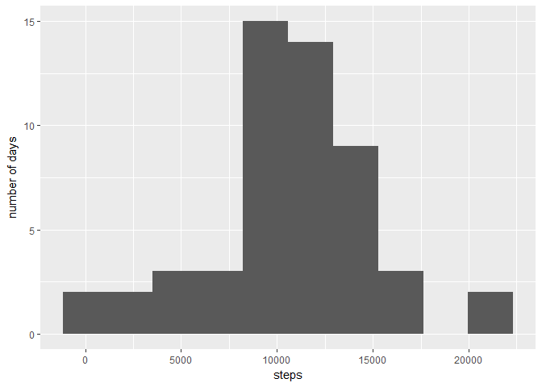
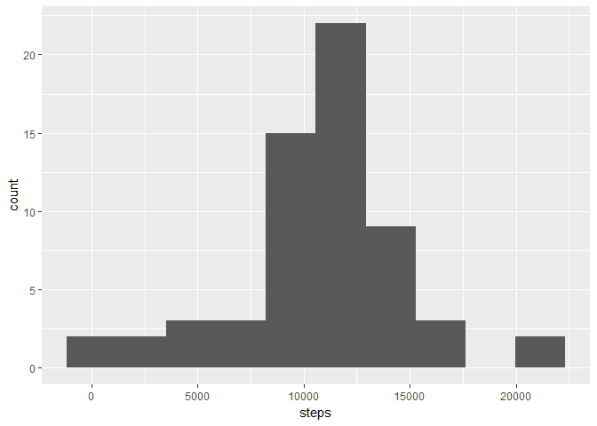
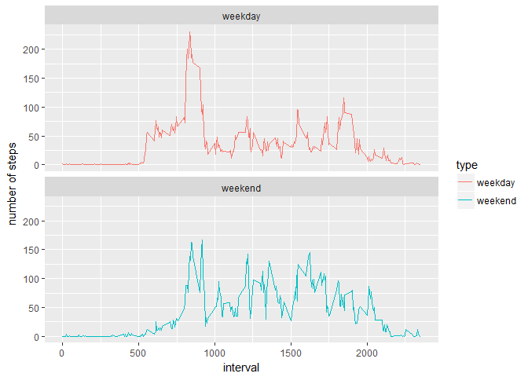

# Reproducible Research: Peer Assessment 1

The following report answers various questions on data collected from a personal activity monitoring device.  
The data consists of two months of data from an anonymous individual collected during the months of October and November, 2012 and include the number of steps taken in 5 minute intervals each day. 


## Loading and preprocessing the data

In order to be able to conduct the research we first load the data and save it in the dataframe `activity`.


```r
temp <- tempfile()
download.file("https://d396qusza40orc.cloudfront.net/repdata%2Fdata%2Factivity.zip",temp)
activity <- read.csv(unz(temp, "activity.csv"))
unlink(temp)
```

## What is mean total number of steps taken per day?

For this part of the research we ignore missing values.
We compute the total number of steps per day.

```r
stepsPerDay <- aggregate(steps~date, activity, FUN = sum)
```

The following plot shows a histogram of the total number of steps taken per day.


```r
library(ggplot2)
ggplot(data = stepsPerDay, aes(x = steps)) + geom_histogram(bins = 10) +
    ylab("number of days")
```

<!-- -->

The mean and median of steps taken per day are:  


```r
mean(stepsPerDay$steps)
```

```
## [1] 10766.19
```

```r
median(stepsPerDay$steps)
```

```
## [1] 10765
```


## What is the average daily activity pattern?

For exploring the average daily activity pattern we make a time series plot  of the 5-minute interval (x-axis) and the average number of steps taken, averaged across all days (y-axis).


```r
avgPerInterval <- aggregate(steps~interval, activity, FUN = mean)
ggplot(data = avgPerInterval, aes(x = interval, y = steps)) + geom_line()
```

<!-- -->

We see that the interval with the highest average number of steps is the interval with the number 835.

## Imputing missing values

Note that there are a number of days/intervals where there are missing values (coded as `NA`). The presence of missing days may introduce bias into some calculations or summaries of the data.  
The number of missing values is:


```r
sum(is.na(activity$steps))
```

```
## [1] 2304
```

In order to impute the missing values we use the already computed average per interval (over all days).


```r
activityImpute <- merge(activity, avgPerInterval, by = "interval")
activityImpute[is.na(activityImpute$steps.x), "steps.x"] <-  activityImpute[is.na(activityImpute$steps.x), "steps.y"]
activityImpute <- activityImpute[,-4]
names(activityImpute) <- c("interval", "steps", "date")
```

In order to see the results of the imputation we repeat the analysis of the total number of steps taken per day: 


```r
stepsPerDayInpute <- aggregate(steps~date, activityImpute, FUN = sum)

ggplot(data = stepsPerDayInpute, aes(x = steps)) + geom_histogram(bins = 10)
```

<!-- -->

```r
mean(stepsPerDayInpute$steps)
```

```
## [1] 10766.19
```

```r
median(stepsPerDayInpute$steps)
```

```
## [1] 10766.19
```

We see that the mean stays the same but the median gets higher and now equals the mean. The reason for this is the strategy used for imputing. 

## Are there differences in activity patterns between weekdays and weekends?

In order to answer the question we use the dataset with the imputed values and create a variable `type`.


```r
activityImpute$weekday <- weekdays(as.Date(activityImpute$date))
activityImpute$type <- 
    as.factor(ifelse(activityImpute$weekday %in% c("Samstag", "Sonntag"),"weekend","weekday"))
```


```r
avgPerIntervalWeek <- 
    aggregate(steps~interval+type, activityImpute, FUN = mean)
ggplot(data = avgPerIntervalWeek, aes(x = interval, y = steps)) +
    geom_line(aes(color = type)) +
    facet_wrap(~type, ncol = 1, nrow = 2) +
    ylab("number of steps")
```

<!-- -->
